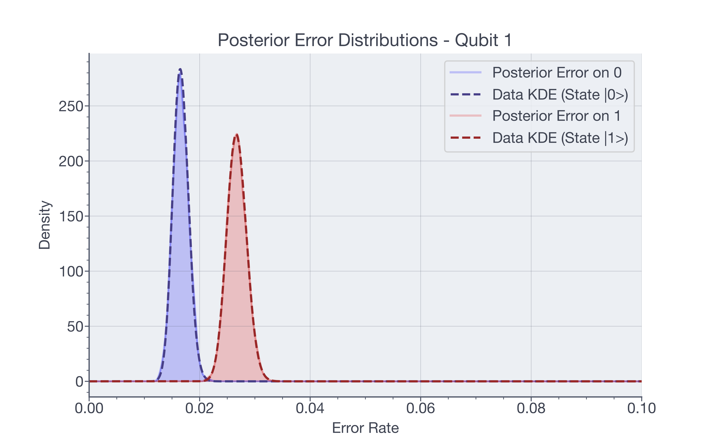
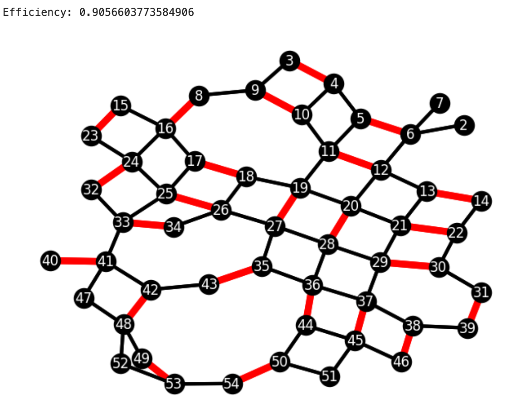
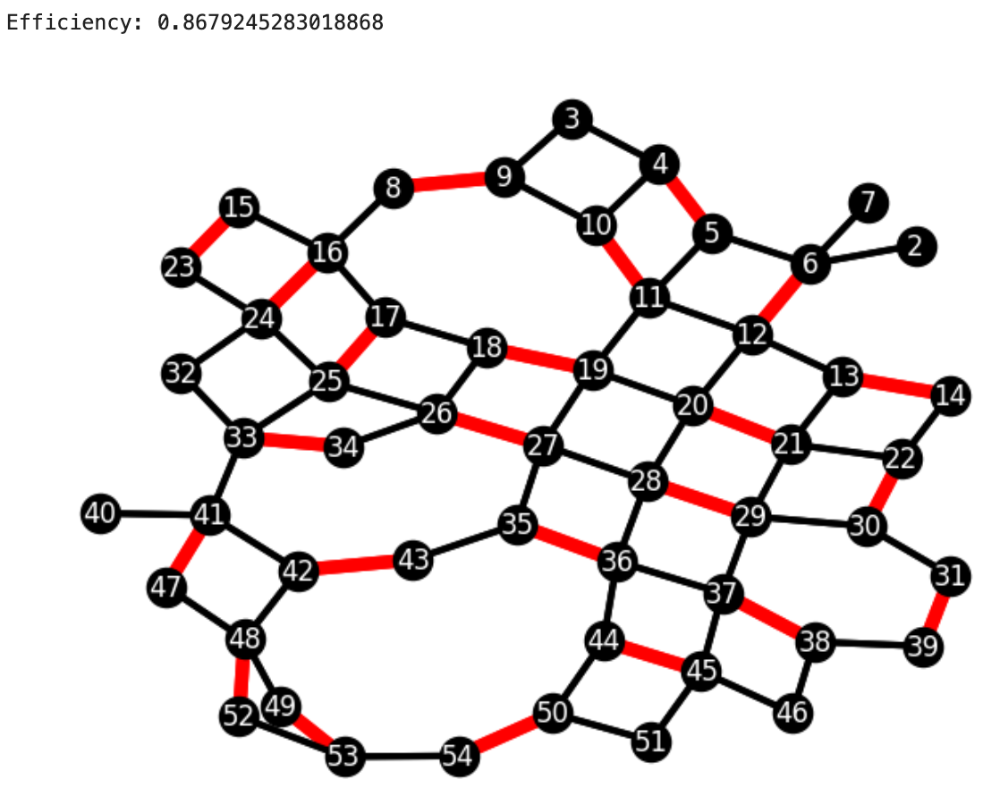
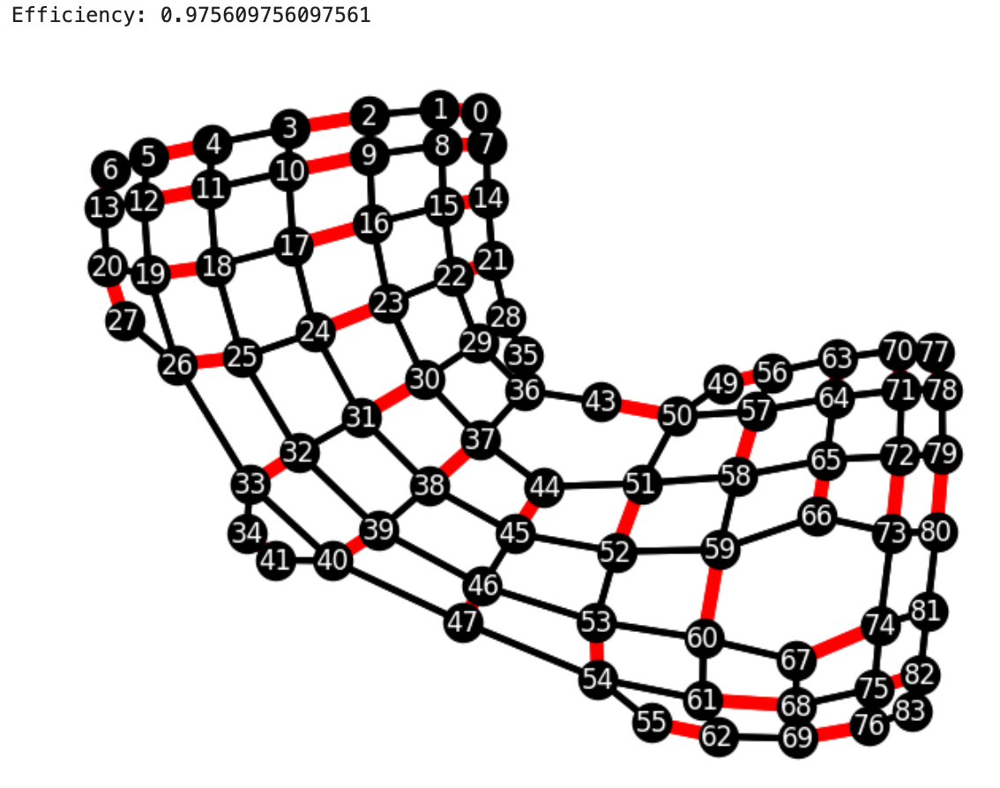
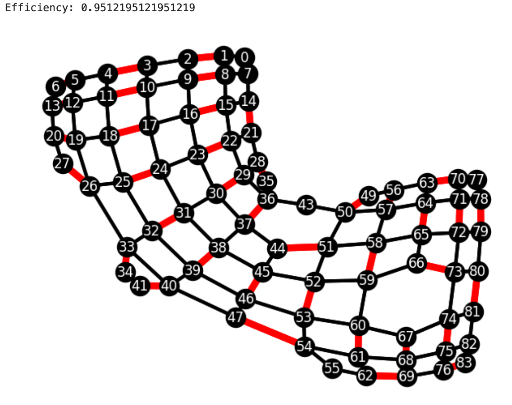
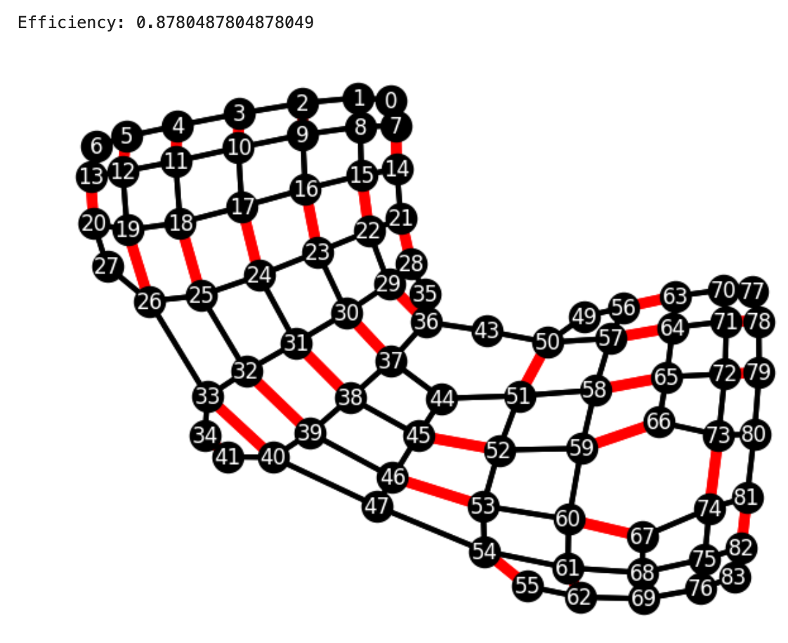
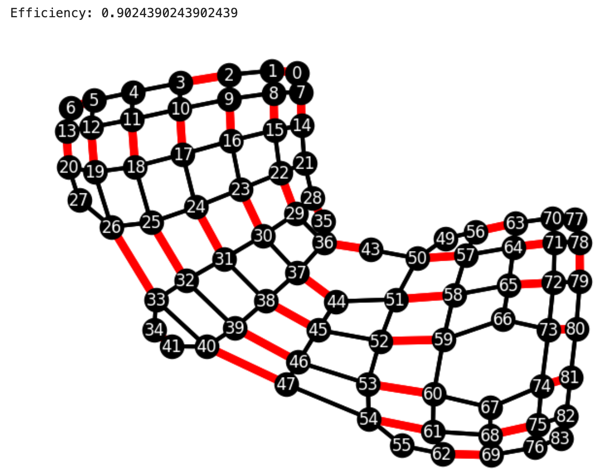
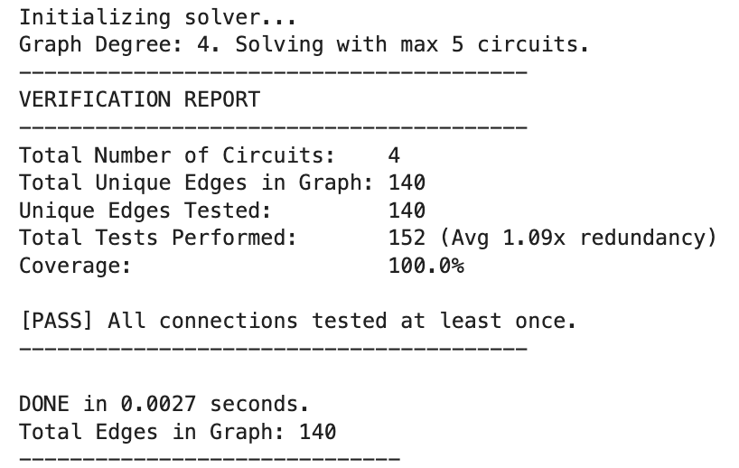

# UnNoiseCompile
A repository for developing _scalable_ and hardware-aware quantum compilation to minimise bitflip gate and measurement noise.

## Folder Structure

Much of this repository is built on proper management of experimental data gathered from probe circuits to be used on QPUs. As such, folder management and organistaion is crucial. The following is strongly suggested to ensure that the functions run smoothly without too much manipulation of subfolders:

```text
Project_Root/
│
│
├── setup.py                   <-- setup.py describing the version, dependencies, etc.
│
│
├── notebooks/
│   ├── notebook1.ipynb
│   └── notebook2.ipynb        <-- Any notebooks to run scripts
│
├── src/
│   ├── __init__.py
│   ├── graphconnector.py      <-- Build Graphs for 2-Qubit Gates
│   ├── splitmeasfilter.py     <-- Measurement Error & Inference
│   └── splitgatefilter.py     <-- Gate Error & Inference
│
├── data/
│   ├── *meas_cal*/             <-- Output folder for MeasFilter
│   └── *gate_exp*/             <-- Output folder for GateFilter
│
└── results/                   <-- Final plots and reports
```

## Getting Started
\
Python modules built using Python 3.11.14 in `/src`, with notebooks and samples written mostly using Jupyter notebooks in `/notebooks` and `/scripts/`. 

First, to make a .venv file as a virtual environment (use Python3.11 for Qiskit compatibility): 

`python3.11 -m venv .venv`

Activate:

Linux/macOS:\
`source .venv/bin/activate`


Windows Command Prompt:\
`.venv\Scripts\activate.bat`


Then install packages using pip:

`pip install -r requirements.txt`

To allow access to the `src/` folder for scripts, run the following to allow python to recognise the `__init__.py` and `setup.py` files already present:

`pip install -e .`

And run from there!

## The Workflow

### 1. Measurement Data

You can supply bitstring data, in the form of the `QuantumTask.result().measurements` available from the Amazon Braket API into the `SplitMeasFilter` by placing a csv file named `State0.csv` defining the a nontrivial groundstate measurement in the path defined by the `file_address` parameter. Similarly, one should place `State1.csv`, a csv file containing the bits recieved from a nontrivial flip.

The script is designed to run inference on data gathered from an expected |000...000> state and an expected |111...111> state individually. This is due to the fact that measurement errors will generally be asymmetric, according to the physics of the QPU system. `|0>` is often a ground state, and relaxes more often than exciting to the `|1>` state, for example. Thus, we run two rounds of inference to understand these asymmetric properties.

Here is a sample of how one is to use the `SplitMeasFilter` Python Class, designed to infer posterior distributions of these errors, and efficiently filter these errors from given quantum data.

```python
from src.splitmeasfilter import SplitMeasFilter

# Define measurement order of qubits
# VERY important, to ensure that the order of the data recieved is the order that AWS produced
# More often than not for complex circuits, this will not be in ascending order!
# Find through running `QuantumTask.result().measured_qubits` in the Braket API
qubits = [0, 1, 6]

# Define whichever directory contains both `State0.csv` and `State1.csv` (or only one if that alone is given)
meas_path = './data/meas_cal/'

# Instantiate Data (from `State0.csv` and `State1.csv` files)
meas_filter = SplitMeasFilter(qubit_order=qubits,    # Qubit order as above
                             file_address=meas_path, # Location of data as above
                             load_data=True,         # (optional) Load posteriors from previous inference trials
                             home_dir='.'            # (optional) Define the working directory
                             )
```
\
We can then run inference on this data:

```python
# Applying the meas_filter.inference() function
# on batches of size shots_per_point
# The 'prep_state' variable can be '0' or '1', defining either
# |000...000> or |111...111> to infer either error in measuring |0> or |1>

meas_filter.inference(nPrior=40000,          # Number of tested error rates
                        prior_sd=0.1,        # The sd of the prior distribution
                        shots_per_point=1024,# Number of shots in each batch
                        seed=28,             # Seed for the rejection sampling
                        prep_state='0')      # Prepared state (for |0> or |1>)

meas_filter.qubit_order = [1,0]

meas_filter.inference(nPrior=40000,          # Number of tested error rates
                        prior_sd=0.1,        # The sd of the prior distribution
                        shots_per_point=1024,# Number of shots in each batch
                        seed=28,             # Seed for the rejection sampling
                        prep_state='1')      # Prepared state (for |0> or |1>)
``` 
\
This will produce files in a dedicated `Posterior Data` directory located in the directory specified by the `file_address` parameter:\
`State0_Post_Qubit0.csv`,\
`State0_Post_Qubit1.csv`,\
`State0_Post_Qubit6.csv`,\
`State1_Post_Qubit1.csv`,\
`State1_Post_Qubit0.csv`,

Which are sampled arrays from posterior distribution of error rates for each qubit and each state we inferred on. We also recieve the full data in the form of an easy to load (and read) JSON file, both containing full distributions as above and summary statistics (mean, mode, and confidence interval). These are found both timestamped to retain copies of data, along with the latest run marked as:

`Post_Full_Current.json`\
`Post_MeanMode_Current.json`

Alongside the data, the posterior distributions will be saved as plots in the same `file_address` directory, named as:\
`ErrorDist_Qubit{QUBIT_NUMBER}.pdf`

For example, here is a plot that may have been produced by the above script:



which contain the posterior distributions of measurement errors, in the form of rejection-sampled error rates. To reproduce these plots, along with printing a full description of all distribution statistics, and optionally save, run:

```python
meas_filter.error_distributions(plotting=True, save_plots=True)
```
And this will produce the error rate variables in the `MeasFilter` class. If the `SplitMeasFilter` object is already loaded in, one can access the full posteriors (for example for Qubit 0) without loading a `.csv` with the following nested dictionaries `post_full` and `post`:
```python
Qubit0_error_0_array = meas_filter.post_full['Qubit0']['0']
Qubit0_error_1_array = meas_filter.post_full['Qubit0']['1']
```
And the summary statistics:
```python
Qubit0_error_0_mean = meas_filter.post['Qubit0']['e0mean']
Qubit0_error_0_mode = meas_filter.post['Qubit0']['e0mode']
Qubit0_error_0_CI = meas_filter.post_full['Qubit0']['e0CI95']
```

### 2. Gate Data

#### 2a. Considering a Testing Circuit

It is not a trivial problem to design an efficient circuit to test 2-qubit gates. First we discuss which 2-qubit gates we can test:

If the _Controlled-Z_ gate is the native 2-qubit gate (as for most superconducting QPUs at the time of writing in January of 2026), there is no direction to the gate, so _CZ[Q1-Q2]_ is the same as _CZ[Q2-Q1]_, so we need only test every connection between qubits. Also, the _CZ_ gate will act on basis states only by adding a total phase, so under our bitflip assumption it is relatively easy to isolate individual qubit error rates.

If the _iSWAP_ gate is the native 2-qubit gate (for instance on Rigetti's Ankaa-3), then there is also no direction, and iSWAP[Q1-Q2]_ is the same as _iSWAP[Q2-Q1]_. However, the _iSWAP_ gate works on basis states by flipping the value of each qubit it acts on, and adding a phase. This makes isolating individual qubit error rates intractable, especially if many gates must be tested with high measurement error rates (unfortunately both are the case as of January 2026 for testing Ankaa-3!).

Single qubit gates are relatively simple to test. One runs a verbatim test, and ensures that the number of gates matches the circuit, and inputs the gate type and the number of gates. All standard native single qubit gates (full rotation gates) are considered in the module, and the expected state is automatically calculated and inferred against

#### 2b. Designing a 2-Qubit Testing Circuit

However, superconducting qubits are often arranged in somewhat complex arrangements on a cartesian grid, with a connectivity of any qubit being anywhere from 1 to 4. The arrangements can also change if the QPU has been calibrated and qubits removed or disconnected. We will then need to construct 4 circuits, where each 2-qubit connection is tested in at least one of these 4 circuits.

As this problem is equivalent to the maximal edge-colouring problem from graph theory, there are many algorithms which have been developed to efficiently generate solutions to this exact problem, 'colouring' each connection at least once, and if possible, multiple times, to design 4 circuits which will connect all qubits between them. Using graph theory, we can also say that since the qubits are arranged on a grid, it is a bipartite graph, and thus by König's Theorem it is class 1, and only 4 circuits (and not 5) are required (for this idea, see Vizing's Theorem).

**The** `graphconnector.py` **script and its `MisraGriesSolver` class is an implementation using Kempe Chains in the Misra-Gries algorithm and graph reordering to produce valid data and maximise data quality and efficiency.**

We use the Misra-Gries Edge-Colouring Algorithm, which is efficient of order $\mathcal{O}(N \times E) \equiv \mathcal{O}(N ^ 2)$, of order 'N' number of qubits multiply 'E' number of edges (here qubit coupling). This will be very efficient for NISQ QPUs, and can be improved if the number of circuits can be increased from 4 to 5, or shots become less expensive, wherein finding these graphs becomes easier. 

We here minimise the number of circuits to 4 (which will be either 4 or 5 in a grid-like construction as in current superconducting QPUs), and add in redundant extra qubit calibration coupling tests to infer the gate error with higher accuracy with limited shots.

Below are 2-qubit CZ testing circuit examples from IQM Emerald and Rigetti Ankaa-3. Each have 4 circuits, with red edges being active CZ gates in the circuit, to be run some number of times to determine bit-flip error. An 'Efficiency' is given in the top left of each circuit, which gives the proportion of qubits active in a CZ gate, thus from whom error data can be gathered. Additional statistics concerning the graphs, total CZ gates tested, redundnacy, and time taken to produce them are given in the Ankaa-3 graphs:

##### **IQM Emerald:**
_____________
_Note that the top left corners of each qubit connection graph displays the 'efficiency.' This refers to the number of qubits which are probed in that circuit (0.0 being none, 1.0 being all)._
_____________
| | |
|:---:|:---:|
|  |  |
|  |  |
##### **Rigetti Ankaa-3:**
_____________
_Note that the top left corners of each qubit connection graph displays the 'efficiency.' This refers to the number of qubits which are probed in that circuit (0.0 being none, 1.0 being all)._
_____________
| | |
|:---:|:---:|
|  |  |
|  |  |
##### **Rigetti Ankaa-3 Text Statistics Readout:**
| |
|:---:|
|  |

The notebook containing the code to produce these graphs from the AWS Braket on 7 Jan 2026 can be found in `Tutorial/Producing2QubitGraphs.ipynb`

#### 2b. Inference 

After gathering data from a circuit applying the tested gate to each qubit a set number of times, using the SplitGateFilter class, the gate error can be efficiently inferred. The data should be placed into the directory marked by the `data_file_address` parameter, with the files named as `Readout_{gate_num}{gate_type}Q{QubitNumber}.csv`.

```python
from src.splitgatefilter import SplitGateFilter


# Instantiate our filter class
# Note: data_file_address is used for both I/O in the current script. 
# Ensure raw gate bitstring data gathered from the AWS Braket 
# in the same method as above in Section 1. is contained as a .csv inside 'gate_path'.
# It is recommended to directly provide the name here to ensure file access safety.
my_gate_filter = SplitGateFilter(home_dir='./',meas_cal_dir='./meas_cal/',data_file_address='./2-qubit-data/')
```

Note the three folders. `home_dir` is the project directory, it is optional to declare. `data_file_address` contains all the measured gate data, and will then contain the folder produced by `SplitGateFilter` where the final results are placed, all plots, all posterior distribution arrays, etc. `meas_cal_dir` contains the calibrated informative priors from the `SplitMeasFilter` class performed prior to this calculation.

It is _highly_ recommended to run the `SplitMeasFilter` script before the `SplitGateFilter` script, to ensure accurate measurement error priors, as these can often be the dominant error channel for quantum hardware, and should be accurately modelled to infer other error rates.

We first will run, for example, 40 pi/2 X rotation gates which we have already applied to every qubit on a certain QPU device and gathered into a file named `READOUT_40_X_EXAMPLE.csv`.
```python
# Loading in the order of qubit measurement:
qubit_order = np.loadtxt('./2-qubit-data/READOUT_40_X_EXAMPLE_MEASURED_QUBITS.csv', delimiter=',')

# Define gate type being measured
gate_type = 'X'

# Define number of gates applied to each qubit
gate_num = 40

# Define the file name of our data under `interested_circuits`
interested_circuit = ['READOUT_40_X_EXAMPLE_MEASURED_QUBITS.csv']

my_gate_filter.inference(qubit_orders=[qubit_order],
                         gate_type=gate_type,
                         gate_num=gate_num,
                         interested_circuits=interested_circuits,
                         # qubit_couplings=[], 
                         # ^Left empty, only used for 2-qubit inference
                         nPrior = 40000,
                         meas_sd=0.05,
                         gate_sd=0.01,
                         seed=54,
                         use_informed_priors=True,
                         plotting=True)
```

Produces `State0_Post_Qubit0.csv` etc. Also produces with the variables:
`gate_filter.post['Qubit0']` -- The full $40000 \times 3$ posterior matrix.
`gate_filter.means['Qubit0']` -- The average error rates [Meas0, Meas1, Gate].

To output the fidelity of qubit, both towards and from the ground state, along with the gate error, return `gate_filter.mean()['Qubit0']` or similar for any number Qubit.

<!-- ### Plotting

To plot the data generated, there is an in-built function in the class called ....

```python
``` -->

### Denoising

It is difficult and often intractable to denoise using the gate bitflip errors, the best method would be to compile qubits to utilise their least noisy connections, and gates, thus minimising errors. 

However, a kind of efficient denoiser of **measurement error** in polynomial time is possible, by assuming that measurement error is not correlated (thus, ignoring cross-talk). Such a method is here developed for use of denoising quantum bitstring outputs to better estimate the final quantum state. To denoise a given dictionary of bitstring counts, infer the measurement error rates using the SplitMeasFilter class along with gathered data, and  run the following:

```python
from src.splitmeasfilter import SplitMeasFilter

qubits = [0,1,...]
meas_filter = SplitMeasFilter(qubit_order=qubits, file_address='./data/meas_cal')

data_example = {
    "000": 100,
    "001": 50,
    "010": 75,
    "011": 25,
    "111": 1,
}

# Here the eff_DeNoise() will take a dictionary of bitstrings and their counts, as with `data_example`, and return a denoised data dictionary
# `verbose` gives continual confirmation, GD gives an overkill gradient descent error mitigation technique,
# with lr the learning rate, and max_iter giving the maximum GD iterations
denoised_date = meas_filter.eff_DeNoise(datadict=data_example, percentage=100, verbose=True, GD = False, lr=0.1, max_iter=50)
```
